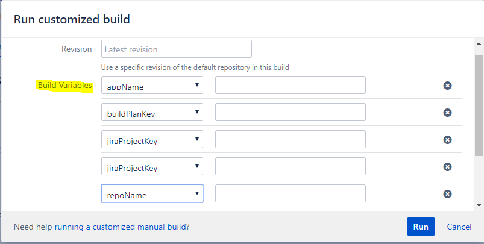

# Springboot Habitat Template
This project provides the wireframe for a new Springboot application being built with Habitat.  It includes the creation of a CHEF INFRA Cookbook to deploy and manage the CHEF Habitat Supervisor.  And, an initial policyfile for the nodes in the policy group `DEV`.
> **The intent of all Template projects is to increase the speed to development.  As such, there may exist gaps that need to be resolved before taking any project started by template beyond development.**

## Motivation
This project was conceived as a way to help facilitate developers working on a new project faster by brining the Source, Build, CHEF Habitat, and CHEF Infra plans all to life from a single job. 
Gaps in the automation should be covered by automated creation of tickets in JIRA.

---

## Features
* Creates Bitbucket repo for Springboot application in a Bitbucket project specified by the executor.
* Populates app repo with small sample springboot app and habitat configurations. Includes Bamboo spec for new build plan and deployment plan.
* Creates Bitbucket repo for a cookbook for the application in the Bitbucket project specified by the executor. The cookbook depends on the [Habitat cookbook](https://github.com/chef-cookbooks/habitat).
* Populates the cookbook repo with a new cookbook for the app.  Includes Bamboo spec for new build plan. Depends on [Kitchen Dokken](https://github.com/test-kitchen/kitchen-dokken) for running Test Kitchen.
* Creates an policyfile that includes the generated cookbook and commits that to a Chef Policyfile repo specified in the CI. 
* Generates a new JIRA ticket in the Support Project for the connection the new repos with Bamboo. (This is a gap in the automation as Bamboo API does not support automating this currently.)

## How to use?
* Configure your Bamboo instance with the following Global or Plan Variables:
   #### These Plan variables are the information we need the CI job executor to supply at run time
   * `appName` - The name of the application we are going to be creating
   * `repoPrjct` - The Bitbucket Project Key where the new repos will be generated
   * `buildPlanKey` - The Bamboo plan key that will be created by the genearted bamboo spec yaml files
   * `jiraProjectKey` - The JIRA project key to tie to the source code for issue generation
   * `userName` - The name of the Owner of the generated project code.  This can be a team name
   * `userEmail` - The email address of the Owner of the generated code
   #### These variables can be set as Global or Plan variables and are required to exist
   * `jksPassword` - This is the password when creating the cert and keystore from Hashicorp Vault
   * `source_url` - The base url of the source code repo without http i.e. bitbucket.mycompany.com
   * `policyfile_project` - The project key in Bitbucket where the repo chef_policyfiles exists for new policyfile creation
   * `jira_url` - The base url of JIRA without http i.e. jira.mycompany.com
   * `supermarket` - The url of the CHEF supermarket being used i.e. `https://mycompany.supermarket.com`
   * `project_key` - The Bamboo project ket where the build plans will be created
   * `vault_addr` - The url of Hashicorp Vault i.e `https://mycompany.vault.com`
   * `hab_jsse_url` - Download url for jsse cert used with Chef Habitat (This is because we use self signed certs) This is used by java during the maven build in Habitat Studio
   * `hab_ssl_cert_url` - Download url for the SSL cert to use with On-Prem Builder (This is because we use self signed certs)
   * `hab_bldr_url` - The url for out on prem builder i.e. `https://mycompany.builder.com`
   * `maven_url` - The url for the Maven repo to use while building in Habitat Studio i.e. `https://mycompany.artifactory.com/artifactory/maven-repo`
   * `issue_project` - The JIRA project key to create the JIRA issues for JIRA admin to add the linked repositories and connect Bamboo Spec
   * `hab_btstrp_file` - The download location of the Chef Habitat tar file used in the cookbook to install Chef Habitat
   * `ktchn_rby_url` - The ruby gem url to be used by test kitchen i.e. `https://mycompany.artifactory.com/artifactory/api/gems/rubygems/`
   * `ktchn_dkkn_image` - The kitchen dokken container to use with test kitchen i.e. `dokken/centos-7`
   * `bamboo_url` - The url for the Bamboo Server i.e. `https://mycompany.bamboo.com`
   * `pkg_origin` - The Chef Habitat Package origiin to use for building and pushing the hart file i.e `my_origin`
   * `hab_access_token` - The token for the origin used to build and push hart files
   * `stashuser` - The user used to authenticate to Bitbucket to create repos
   * `stashpassword` - The password for authenticating to Bitbucket to create repos
   * `jiraUser` - The user used to authenticate to JIRA to create issues
   * `jiraUserPassword` - The password for authenticating to JIRA to create issues
   #### These variables can be set as Global or Plan variables and are required to exist.  They are specific to Fortify, if not using Fortify you will may want to consider removing the Fortify components of the template project in a copy of this project
   * `fortifyPath` - Path to fortify version on Bamboo agent executing fortify scans
   * `fotifyPlugin` - Version of fortify used with Maven
   * `sslPassword` - Keystore password used with fortify cert  for ssl because of self-signed certs
   * `fortifyVersion` - Version of sca.maven.plugin.version
   * `fortifyAuthToken` - Authorization token used to submit to fortify by CI system
   * `fortJdk` - Path to JDK on Bamboo agent that fortify will use to do sca
   * `fortify_url` - The fortify url where the fpr will be uploaded to i.e. `https://mycompany.fortify.com`
   * `fortify_cert` - The cert location on the Bamboo agent that will be used buring the fortify sca i.e. `/opt/certs/fortify.jks`
* Configure a Bamboo build job to:
   * Clean working directory
   * Checkout this source code to a checkout directory called `projectTemplate`
   * Inject Bamboo variables from `projectTemplate/semVer.txt` with the scope of `Result` and prefix `inject`
   * Execute the shell script file `projectTemplate/createProject.sh`
   * Plan requirements are a linux server
* You need to include the following variable overides when running the Bamboo plan:
   * appName - This is the name of the new application.  It will be embedded into many of the configuration files and the artifact name.
   * buildPlanKey - This is a unique key identifier for the bamboo plans.  It can be upto 6 characters long and only contain [A-Z] and [0-9].  
   * jiraProjectKey - This is the project key in JIRA where issues may be logged for this project (i.e. CM, ASV, PEG).  These are the letters in front of the issue id (i.e. CM-9999, ASV-9999, PEG-9999).  You can see them in the key column at !missing_URL.
   * repoPrjct - This is the Bitbucket Project key where the application source code should be put (i.e. AUT, CPT, CEC).  You can see them in the key column on the Bitbucket project page.
   * userEmail - This is the email of the primary maintainer.  May be a individual ews email or a group ews email account.
   * userName - This is the name of the primary maintainer.  May be an individual or a team.  

## Known Gaps in Full Automation
* Linking Bitbucket Repo with Bamboo specs to Bamboo is not automated or available in the Bamboo API.
* Cookbook must past build and be loaded to Supermarket before Policyfile is deployed.

## Contributing
Contributions are welcome via Github pull requests. 

    The most important rule is that contributing must be easy
    and that the community is friendly and not nitpicking on details,
    such as coding style.

If you're reporting a bug you should ensure that your bug report contains enough information to successfully diagnose the issue, and if you're contributing code you should try to mimic the conventions you see surrounding the code you're working on, but in the end all patches will be cleaned up by the person merging the changes so don't worry too much.

For all contributions, please respect the following guidelines:

* Each pull request should implement ONE feature or bugfix. If you want to add or fix more than one thing, submit more than one pull request.
* Do not commit changes to files that are irrelevant to your feature or bugfix (eg: .gitignore).
* Do not add dependencies.
* Be willing to accept criticism and work on improving your code.
* Be aware that the pull request review process is not immediate.
